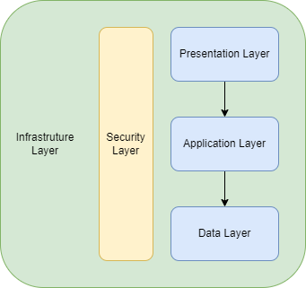
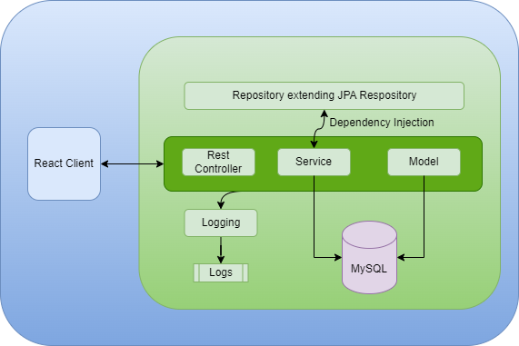
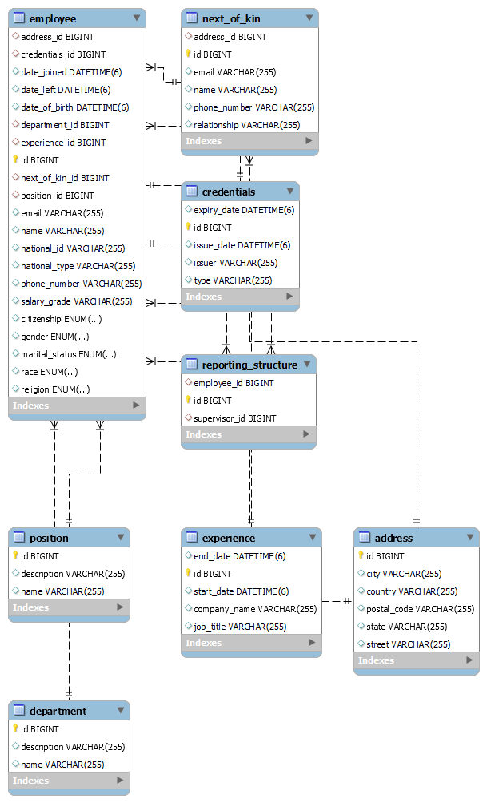

# Employee Management System

This repository contains the source code for an Employee Management System developed using Java and Spring Boot. The system facilitates managing various aspects of employees, including their personal information, addresses, credentials, experiences, departments, positions, next of kin, and reporting structures.

## Table of Contents

1. [Features](#features)
2. [Architecture](#architecture)
3. [Project Structure](#project-structure)
4. [Technologies Used](#technologies-used)
5. [API Documentation](#api-documentation)
6. [httpexchanges](#httpexcahnges)
7. [Class Descriptions](#class-descriptions)
8. [Controller Descriptions](#controller-descriptions)
9. [Service Descriptions](#service-descriptions)
10. [Repository Descriptions](#repository-descriptions)
11. [Setup and Installation](#setup-and-installation)
12. [Usage](#usage)
13. [Contributing](#contributing)
14. [License](#license)

## Features

The Employee Management System provides the following features:

- **Employee Management**: CRUD operations for managing employee details, including personal information, dates, and employment-related information.
- **Address Management**: CRUD operations for managing employee addresses.
- **Credentials Management**: CRUD operations for managing employee credentials such as certificates, licenses, and qualifications.
- **Department Management**: CRUD operations for managing departments within the organization.
- **Experience Management**: CRUD operations for managing employee work experiences.
- **Next of Kin Management**: CRUD operations for managing next of kin details for employees.
- **Position Management**: CRUD operations for managing positions within the organization.
- **Reporting Structure Management**: CRUD operations for managing reporting structures between supervisors and employees.

## Architecture

The Employee Management System follows a layered architecture, with clear separation of concerns:

- **Presentation Layer**: Controllers handle incoming HTTP requests and delegate processing to the appropriate service layer.
- **Service Layer**: Contains service interfaces and implementations to encapsulate business logic. Services interact with repositories to perform CRUD operations.
- **Repository Layer**: Repositories provide an interface to interact with the underlying database. Spring Data JPA is used for data access.
- **Model Layer**: Contains entity classes representing database tables. These classes are mapped to database tables using JPA annotations.

### Architectural Highlights

The architecture is designed for scalability, maintainability, security, and performance. It leverages modern technologies and best practices to deliver a reliable and user-friendly banking experience. Components are organized into layers to separate concerns and facilitate ease of development, testing, and maintenance.

## Project Structure

The project is structured according to functionality and follows a modular approach:

- **Controllers**: Contains classes to handle HTTP requests and responses.
- **Models**: Contains entity classes representing database tables.
- **Repository**: Contains repository interfaces for performing CRUD operations.
- **Services**: Contains service interfaces and implementations to encapsulate business logic.
- **Tests**: Contains unit test classes for controllers and services.
- **Resources**: Contains configuration files such as `application.properties`.

## Technologies Used

The Employee Management System is built using the following technologies:

- **Java**: Main programming language for the backend development.
- **Spring Boot**: Framework for building Java-based enterprise applications.
- **Spring Data JPA**: Provides support for data access using Java Persistence API (JPA).
- **Spring Web**: Provides support for building web applications using Spring MVC.
- **Lombok**: Library to reduce boilerplate code in Java classes.
- **H2 Database**: In-memory database for development and testing purposes.
- **Maven**: Build automation tool and dependency management.
- **JUnit**: Testing framework for writing and running unit tests.

## API Documentation
http://localhost:8080/swagger-ui/index.html

| Endpoint                               | Method | Description                           | Request Body                                    | Response Body                                   |
|----------------------------------------|--------|---------------------------------------|-------------------------------------------------|-------------------------------------------------|
| /api/reportingstructure/{id}           | GET    | Get reporting structure by ID         | -                                               | ReportingStructure                              |
| /api/reportingstructure/{id}           | PUT    | Update reporting structure by ID      | ReportingStructure                              | ReportingStructure                              |
| /api/reportingstructure/{id}           | DELETE | Delete reporting structure by ID      | -                                               | -                                               |
| /api/reportingstructure/              | GET    | Get all reporting structures          | -                                               | Array of ReportingStructure                     |
| /api/reportingstructure/              | POST   | Add a new reporting structure        | ReportingStructure                              | ReportingStructure                              |
| /api/position/{id}                    | GET    | Get position by ID                   | -                                               | Position                                        |
| /api/position/{id}                    | PUT    | Update position by ID                | Position                                        | Position                                        |
| /api/position/{id}                    | DELETE | Delete position by ID                | -                                               | -                                               |
| /api/position/                       | GET    | Get all positions                    | -                                               | Array of Position                               |
| /api/position/                       | POST   | Add a new position                   | Position                                        | Position                                        |
| /api/nextofkin/{id}                   | GET    | Get next of kin by ID                | -                                               | NextOfKin                                       |
| /api/nextofkin/{id}                   | PUT    | Update next of kin by ID             | NextOfKin                                      | NextOfKin                                       |
| /api/nextofkin/{id}                   | DELETE | Delete next of kin by ID             | -                                               | -                                               |
| /api/nextofkin/                      | GET    | Get all next of kin                  | -                                               | Array of NextOfKin                              |
| /api/nextofkin/                      | POST   | Add a new next of kin                | NextOfKin                                      | NextOfKin                                       |
| /api/experience/{id}                  | GET    | Get experience by ID                 | -                                               | Experience                                      |
| /api/experience/{id}                  | PUT    | Update experience by ID              | Experience                                     | Experience                                      |
| /api/experience/{id}                  | DELETE | Delete experience by ID              | -                                               | -                                               |
| /api/experience/                     | GET    | Get all experiences                  | -                                               | Array of Experience                             |
| /api/experience/                     | POST   | Add a new experience                 | Experience                                     | Experience                                      |
| /api/employee/{id}                    | GET    | Get employee by ID                   | -                                               | Employee                                        |
| /api/employee/{id}                    | PUT    | Update employee by ID                | Employee                                       | Employee                                        |
| /api/employee/{id}                    | DELETE | Delete employee by ID                | -                                               | -                                               |
| /api/employee/                       | GET    | Get all employees                    | -                                               | Array of Employee                               |
| /api/employee/                       | POST   | Add a new employee                   | Employee                                       | Employee                                        |
| /api/department/{id}                  | GET    | Get department by ID                 | -                                               | Department                                      |
| /api/department/{id}                  | PUT    | Update department by ID              | Department                                     | Department                                      |
| /api/department/{id}                  | DELETE | Delete department by ID              | -                                               | -                                               |
| /api/department/                     | GET    | Get all departments                  | -                                               | Array of Department                             |
| /api/department/                     | POST   | Add a new department                 | Department                                     | Department                                      |
| /api/credentials/{id}                 | GET    | Get credentials by ID                | -                                               | Credentials                                     |
| /api/credentials/{id}                 | PUT    | Update credentials by ID             | Credentials                                    | Credentials                                     |
| /api/credentials/{id}                 | DELETE | Delete credentials by ID             | -                                               | -                                               |
| /api/credentials/                    | GET    | Get all credentials                  | -                                               | Array of Credentials                            |
| /api/credentials/                    | POST   | Add a new credentials                | Credentials                                    | Credentials                                     |
| /api/address/{id}                     | GET    | Get address by ID                    | -                                               | Address                                         |
| /api/address/{id}                     | PUT    | Update address by ID                 | Address                                        | Address                                         |
| /api/address/{id}                     | DELETE | Delete address by ID                 | -                                               | -                                               |
| /api/address/                        | GET    | Get all addresses                    | -                                               | Array of Address                                |
| /api/address/                        | POST   | Add a new address                    | Address                                        | Address                                         |

## httpexcahnges
The httpexchanges endpoint provides information about HTTP request-response exchanges.
http://localhost:8080/actuator/httpexchanges

## Class Descriptions

### Address
- **Description**: Represents an employee's address with street, city, state, postal code, and country.
- **Attributes**: `id`, `street`, `city`, `state`, `postalCode`, `country`.

### Credentials
- **Description**: Represents credentials such as certificates or licenses with type, issuer, issue date, and expiry date.
- **Attributes**: `id`, `type`, `issuer`, `issueDate`, `expiryDate`.

### Department
- **Description**: Represents a department within the organization with a name and description.
- **Attributes**: `id`, `name`, `description`.

### Employee
- **Description**: Represents an employee with personal information, employment details, and related entities such as address, next of kin, credentials, etc.
- **Attributes**: `id`, `name`, `email`, `phoneNumber`, `dateJoined`, `dateLeft`, `dateOfBirth`, `nationalType`, `nationalId`, `race`, `citizenship`, `religion`, `gender`, `maritalStatus`, `address`, `nextOfKin`, `credentials`, `experience`, `department`, `position`, `salaryGrade`.

### Experience
- **Description**: Represents an employee's work experience with company name, job title, start date, and end date.
- **Attributes**: `id`, `companyName`, `jobTitle`, `startDate`, `endDate`.

### NextOfKin
- **Description**: Represents the next of kin for an employee with name, relationship, phone number, email, and address.
- **Attributes**: `id`, `name`, `relationship`, `phoneNumber`, `email`, `address`.

### Position
- **Description**: Represents a position within the organization with a name and description.
- **Attributes**: `id`, `name`, `description`.

### ReportingStructure
- **Description**: Represents the reporting structure between supervisors and employees with supervisor and employee IDs.
- **Attributes**: `id`, `supervisor`, `employee`.

## Controller Descriptions

### AddressController
- **Description**: Handles HTTP requests related to addresses.
- **Endpoints**: `/addresses`, `/addresses/{id}`.

### CredentialsController
- **Description**: Handles HTTP requests related to credentials.
- **Endpoints**: `/credentials`, `/credentials/{id}`.

### DepartmentController
- **Description**: Handles HTTP requests related to departments.
- **Endpoints**: `/departments`, `/departments/{id}`.

### EmployeeController
- **Description**: Handles HTTP requests related to employees.
- **Endpoints**: `/employees`, `/employees/{id}`.

### ExperienceController
- **Description**: Handles HTTP requests related to work experience.
- **Endpoints**: `/experiences`, `/experiences/{id}`.

### NextOfKinController
- **Description**: Handles HTTP requests related to next of kin.
- **Endpoints**: `/nextofkin`, `/nextofkin/{id}`.

### PositionController
- **Description**: Handles HTTP requests related to positions.
- **Endpoints**: `/positions`, `/positions/{id}`.

### ReportingStructureController
- **Description**: Handles HTTP requests related to reporting structures.
- **Endpoints**: `/reportingstructures`, `/reportingstructures/{id}`.

## Service Descriptions

### AddressService
- **Description**: Provides business logic related to addresses.

### CredentialsService
- **Description**: Provides business logic related to credentials.

### DepartmentService
- **Description**: Provides business logic related to departments.

### EmployeeService
- **Description**: Provides business logic related to employees.

### ExperienceService
- **Description**: Provides business logic related to work experience.

### NextOfKinService
- **Description**: Provides business logic related to next of kin.

### PositionService
- **Description**: Provides business logic related to positions.

### ReportingStructureService
- **Description**: Provides business logic related to reporting structures.

## Repository Descriptions

### AddressRepository
- **Description**: Provides CRUD operations for addresses.

### CredentialsRepository
- **Description**: Provides CRUD operations for credentials.

### DepartmentRepository
- **Description**: Provides CRUD operations for departments.

### EmployeeRepository
- **Description**: Provides CRUD operations for employees.

### ExperienceRepository
- **Description**: Provides CRUD operations for work experience.

### NextOf

KinRepository
- **Description**: Provides CRUD operations for next of kin.

### PositionRepository
- **Description**: Provides CRUD operations for positions.

### ReportingStructureRepository
- **Description**: Provides CRUD operations for reporting structures.

## Setup and Installation

To run the Employee Management System locally, follow these steps:

1. Clone this repository to your local machine.
2. Make sure you have Java and Maven installed.
3. Configure the database settings in `application.properties` if necessary.
4. Build the project using Maven: `mvn clean install`.
5. Run the application: `mvn spring-boot:run`.

## Usage

Once the application is running, you can access the endpoints provided by the controllers to perform various CRUD operations on employee-related entities. Use tools like Postman or curl to interact with the API endpoints.

## Contributing

Contributions to the Employee Management System are welcome! If you find any issues or have suggestions for improvement, please open an issue or submit a pull request.

## License

This project is licensed under the [MIT License](LICENSE).